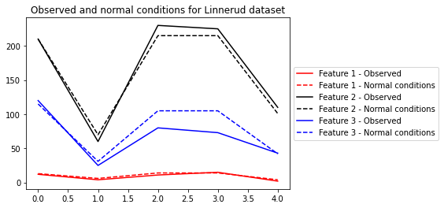
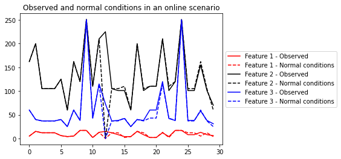

*****
Usage
*****

Simple example
--------------

In the following, we use :class:`AAKR <aakr._aakr.AAKR>` on `Linnerud dataset <https://scikit-learn.org/stable/datasets/index.html#linnerrud-dataset>`_, to find out values we expect to see in normal conditions for part of the dataset.

First, we import the necessary libraries.

.. code-block:: python

    from aakr import AAKR
    from sklearn.datasets import load_linnerud

Second, we load the dataset and split it into two parts:

1) :code:`X_nc` with examples of normal conditions
2) :code:`X_obs` with observed values, for which we want to find values we would've expected to see in normal conditions

.. code-block:: python

    # Load dataset (20 samples, 3 features)
    X = load_linnerud().data

    # Use first 15 as examples of normal conditions
    X_nc = X[:15]

    # New observations to get normal condition for
    X_obs = X[15:]

Third, we create the AAKR model and :class:`fit <aakr._aakr.AAKR.fit>` the normal condition examples.

.. code-block:: python

    # Create AAKR and fit first 15 observations
    aakr = AAKR()
    aakr.fit(X_nc)

Fourth, we use :class:`transform <aakr._aakr.AAKR.transform>` to obtain the normal conditions.

.. code-block:: python

    # Normal conditions for the last 5 observations
    X_obs_nc = aakr.transform(X_obs)

Finally, we plot the results.

.. code-block:: python

    # Plot results
    import matplotlib.pyplot as plt

    colors = 'rkb'
    for i in range(X.shape[1]):
        plt.plot(X_obs[:, i], color=colors[i], linestyle='-',
                label=f'Feature {i + 1} - Observed')
        plt.plot(X_obs_nc[:, i], color=colors[i], linestyle='--',
                label=f'Feature {i + 1} - Normal conditions')
        
    plt.title('Observed and normal conditions for Linnerud dataset')
    plt.legend(loc='center left', bbox_to_anchor=(1, 0.5))

Online example
--------------

AAKR is well suited for scenarios where fit and predict needs to be performed as new values come in, e.g. from sensors. The following is an example of this kind of a scenario.

First, we create a data generator that simulates a sensor.

.. code-block:: python

    import numpy as np

    from aakr import AAKR
    from sklearn.datasets import load_linnerud

    np.random.seed(2020)

    def data_generator(n_iters=50):
        """Generates rows randomly from Linnerud dataset."""
        X = load_linnerud().data

        for i in range(n_iters):
            yield X[[np.random.choice(X.shape[0])]]

Second, we create a new instance of the model.

.. code-block:: python

    # Initiate model
    aakr = AAKR()

Third, we iterate :code:`n_iters` times over sensor values, where first :code:`n_train` observations are used for fitting AAKR model one-by-one by utilizing the :class:`partial_fit <aakr._aakr.AAKR.partial_fit>` -method. The results are saved into lists.

.. code-block:: python

    # Simulate data flow
    n_train = 12  # Use first `n_train` observations for fitting
    n_iters = 30  # Number of iterations from data generator

    X = []
    X_obs_nc = []
    for i, X_obs in enumerate(data_generator(n_iters)):
        
        # Fit latest observation
        if i < n_train:
            aakr.partial_fit(X_obs)
            
        # Based on the history, what should we see in normal conditions
        X_obs_nc_latest = aakr.transform(X_obs)
        
        # Save original observation and normal condition values
        X.append(X_obs[0])
        X_obs_nc.append(X_nc[0])

Finally, we plot the results.

.. code-block:: python

    # Plot results
    import matplotlib.pyplot as plt

    X = np.array(X)
    X_obs_nc = np.array(X_obs_nc)

    colors = 'rkb'
    for i in range(X.shape[1]):
        plt.plot(X[:, i], color=colors[i], linestyle=':',
                label=f'Feature {i + 1} - Observed')
        plt.plot(X_obs_nc[:, i], color=colors[i], linestyle='-',
                label=f'Feature {i + 1} - Normal conditions')
        
    plt.title('Observed and normal conditions in an online scenario')
    plt.legend(loc='center left', bbox_to_anchor=(1, 0.5))

